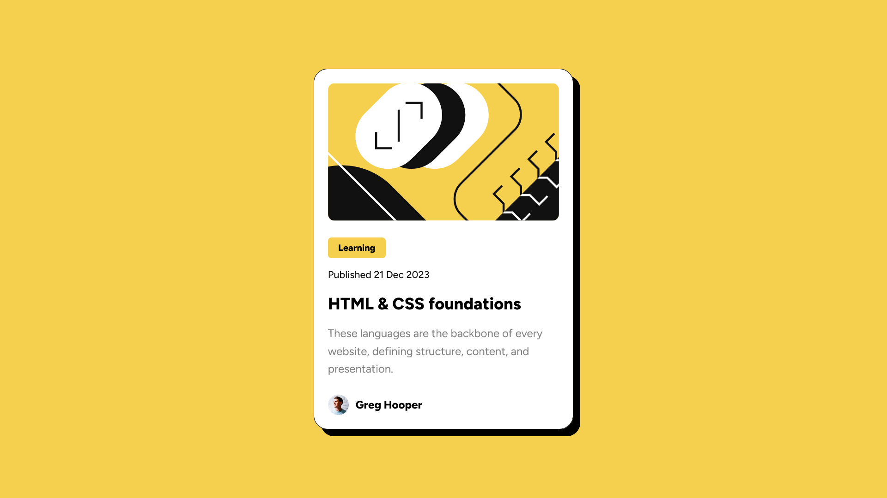
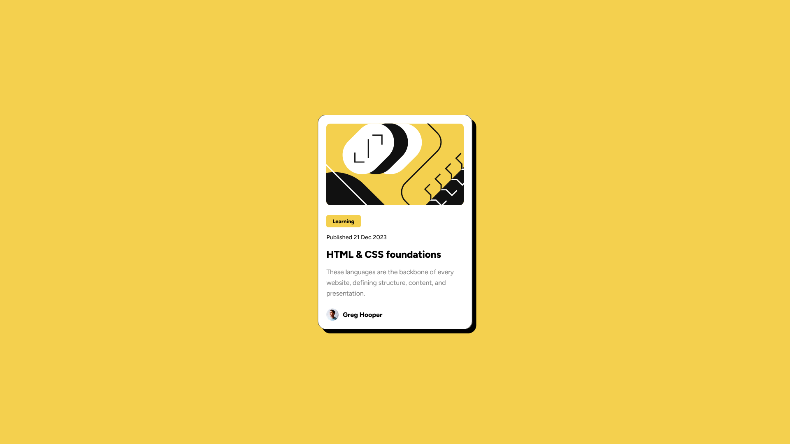

# Frontend Mentor - Blog preview card solution

This is a solution to the [Blog preview card challenge on Frontend Mentor](https://www.frontendmentor.io/challenges/blog-preview-card-ckPaj01IcS). Frontend Mentor challenges help you improve your coding skills by building realistic projects. 

## Table of contents

- [Overview](#overview)
  - [The challenge](#the-challenge)
  - [Screenshot](#screenshot)
  - [Links](#links)
- [My process](#my-process)
  - [Built with](#built-with)
  - [What I learned](#what-i-learned)
  - [Continued development](#continued-development)
  - [Useful resources](#useful-resources)
- [Author](#author)
- [Acknowledgments](#acknowledgments)

## Overview

### The challenge

Users should be able to:

- See hover and focus states for all interactive elements on the page

### Screenshot

### Links

- Solution URL: [Add solution URL here](https://your-solution-url.com)
- Live Site URL: [Add live site URL here](https://your-live-site-url.com)

## My process

### Built with

- Semantic HTML5 markup
- CSS custom properties
- Flexbox

### What I learned

I use html and css only for this solution. With hover selector as focus state. This is my first time using hover on my project, so this is a new lesson for me

### Continued development

I think a lot of modern design use hover or focus selector for much more interactive design. So I think I will learn about interactive design more in the future.

### Useful resources

- [ChatGPT](https://chatgpt.com/) - This helped me for problem solving.
- [W3School](https://www.w3schools.com/) - This is an amazing lesson and document about programing.

## Author

- Github - [Spoer](https://github.com/Spoer)
- Frontend Mentor - [@Spoer](https://www.frontendmentor.io/profile/Spoer)
- Instagram - [@yuliowidi](https://www.instagram.com/yuliowidi)
# Blog-Card

